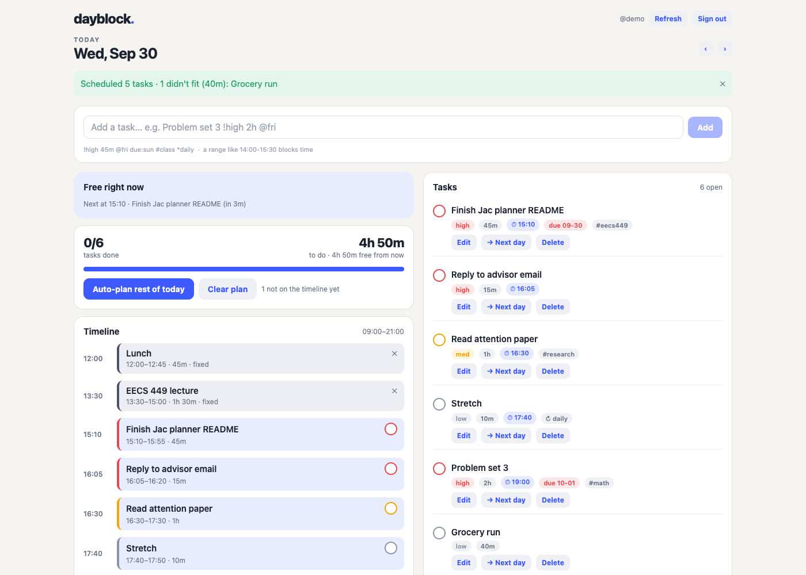
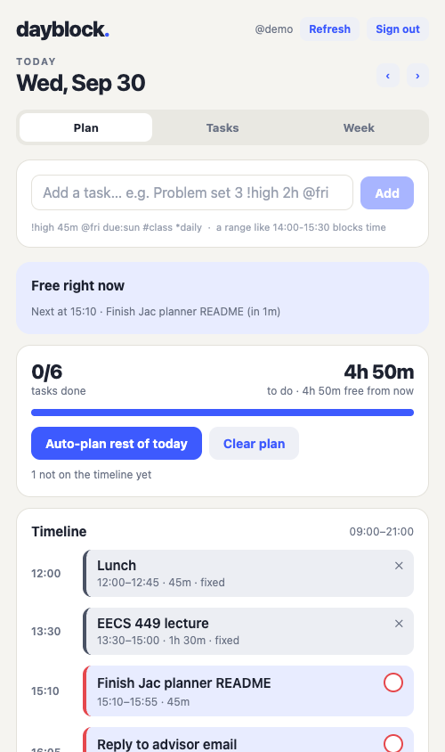

# Dayblock: plan your day in blocks

**EECS 449 · Assignment 1: Personal Planning App in Jac**
**Name:** Zhengjia Sun · **UMID:** 21579035

Dayblock is a personal day planner built around one idea: **your fixed commitments
(classes, meals, the gym) are the skeleton of the day, and everything else should be
fitted around them automatically.** You jot tasks down in one line of shorthand, pin
the time you can't move, and press **Auto-plan**. Dayblock fits your open tasks into
the free gaps, in priority and deadline order, with a break after each one. It
splits a long task across gaps when it has to and tells you what didn't fit.

It is one Jac project with four parts that share one planner service and one
database: a **server**, a **web app**, a **mobile app** and a **CLI**.

| Web (desktop browser) | Mobile (phone) |
| --- | --- |
|  |  |

## Main features

- **One-line quick add**, the same on every client:
  `Problem set 3 !high 2h @fri due:sun #math`
  - `!high` / `!med` / `!low` (or `!1`–`!3`): priority
  - `45m`, `1.5h`, `1h30m`: estimate (default 30m)
  - `@today`, `@tmr`, `@fri`, `@+3`, `@10-05`: the day it is planned for
  - `due:sun` (or `^sun`): deadline
  - `#tag`: a tag, and `*daily` / `*weekdays` / `*weekly`: repeats
  - **A time range makes a fixed block instead of a task:** `Lecture 13:30-15:00 @mon`
- **Auto-plan (the hook).** A deterministic scheduler, no AI or API key needed:
  - It computes free gaps between your working hours and fixed blocks, starting from *now* when you plan today.
  - It orders tasks by due-today first, then priority, then nearest deadline, then age.
  - Each task goes in the earliest gap that holds it whole. Only if none can, it is split across gaps, never into pieces shorter than 25 minutes.
  - It leaves a configurable break after each task and reports what didn't fit and how much time it needed.
- **Now / Next**: what you should be doing right now and what's next (web, phone, `cli now`).
- **Timeline** of fixed blocks, scheduled tasks and remaining free gaps; check tasks off right on it.
- **Overload warning**: "4h 50m to do · 3h free": the day turns red when it's over-booked.
- **Repeating tasks**: finishing a `*daily` task queues tomorrow's copy (never twice).
- **Rollover**: unfinished tasks from earlier days are flagged and moved to today in one tap.
- **Week view**: each day's planned load against its real capacity after fixed blocks, plus a completion **streak**.
- **Accounts**: every user plans on their own private graph; all endpoints need a login.
- **Sample day**: an empty account can load a realistic student day in one tap to try everything.

## How the four components fit together

```
                ┌──────────────────────────────────────────────┐
                │  planner service  (core/planner.jac)         │
                │  def:protect endpoints · per-user root graph │
                │  root → Prefs, Task*, Block*                 │
                │  uses core/schedule.jac (parser, scheduler)  │
                └──────────────▲───────────────▲───────────────┘
            in-process bridge  │               │  HTTP bridge (JAC_APP_PLANNER_URL)
     ┌─────────────────────────┴──┐     ┌──────┴───────────────┐
     │  web app (web.jac)         │     │  CLI (cli.jac)        │
     │  served by `jac run`       │     │  jac run cli -- ...   │
     │  renders ui/app.jac        │     └──────────────────────┘
     └────────────▲───────────────┘
                  │ HTTP bridge (server address chosen in the app)
     ┌────────────┴───────────────┐
     │  mobile app (mobile.jac)   │
     │  React Native via @jac/mobui, same ui/app.jac │
     └────────────────────────────┘
```

- **Server**: `core/planner.jac` is declared as a Jac *service app* (`[apps.planner]`).
  - Every endpoint is `def:protect`: it requires a JWT and runs on the caller's own root, so users never see each other's data.
  - Data is persisted by Jac's graph store (an embedded Postgres under `.jac/data`), so plans survive restarts.
  - All planning rules live in `core/schedule.jac`, pure functions with unit tests.
  - Dates and "now" always come from the client, so "today" is *your* today even if the server is elsewhere.
- **Web**: `web.jac` renders the shared UI `ui/app.jac`. `jac run` serves it together with the colocated planner service on one port. Wide screens get a two-column layout: plan and timeline on the left, tasks, week and settings on the right.
- **Mobile**: `mobile.jac` renders the *same* `ui/app.jac`.
  - It is written only in `@jac/mobui` primitives, so it compiles to real React Native views (Expo) and to the browser (react-native-web).
  - Phones get a tabbed layout (Plan / Tasks / Week) and a "connect to server" step.
- **CLI**: `cli.jac` imports the same service functions (`get_day`, `quick_add`, `auto_plan`, ...). Jac turns those imports into typed async HTTP calls to the running server.
  - It stores your token in `~/.dayblock.json` (mode 600).
  - It numbers tasks, so `done 3` just works.

Everything one client does shows up in the others on the next refresh, because they all
call the same service over the same data.

## What makes it stand out

1. **It solves the real problem of a planner.** A plain to-do list doesn't tell you whether today is realistic. Dayblock turns the list into a concrete timeline around your fixed commitments, warns when you're over-booked, and replans from "now" in one tap.
2. **One grammar everywhere.** The quick-add shorthand is parsed on the server, so it behaves identically on web, phone and terminal. Editing a task re-uses it too: the edit box shows the task as shorthand (`Essay !high 1h30m @2026-10-02 due:2026-10-04`).
3. **One UI codebase for web and native mobile**, responsive rather than duplicated, and one typed API for all three clients.
4. **Tested.** `jac test` runs 15 tests:
   - unit tests of the parser, dates, recurrence and every scheduler rule (whole-fit preference, splitting, the no-tiny-pieces rule, overflow);
   - an end-to-end API test that registers two users, plans a day, checks now/next, recurrence without duplicates, rollover, the week streak and that users can't touch each other's tasks.

## Setup

**Prerequisites:** [Jac](https://jaclang.org/docs/latest) `0.37.23` (the version pinned in
`jac.toml`) on macOS or Linux. Nothing else: Jac bundles its own Python, Bun/Node and an
embedded Postgres. No API keys are needed.

```bash
git clone https://github.com/peterszj/eecs449-planner && cd eecs449-planner
jac install        # optional: fetches npm deps (jac run also does this on first start)
```

> On the macOS standalone `jac` binary, `jac install` can fail with an
> `_posixsubprocess ... symbol not found` error while creating a Python venv. This project
> has no Python dependencies, so skip it: `jac run` installs the npm packages it needs by
> itself.

## Run the server + web app

```bash
jac run
```

(`jac run --no-dev` does the same from a single process without hot reload; use it when you
also want to run the mobile preview, see below.)

Open **http://localhost:8000** and create an account (any username, password of 8+ characters).
On an empty account, click **Load a sample student day**, then **Auto-plan rest of today**.

`jac run` starts the web app and the planner service together: the page is on port 8000, and
the API is proxied through it (dev mode also exposes the API directly on 8001).
Data lives in `.jac/data/`; delete that folder to start fresh.

## Mobile app

The mobile app is a client of the planner server; it never stores data itself.

**Browser preview of the real mobile build** (no phone needed), in two terminals:

```bash
# terminal 1: the server, in single-process mode (see the note below)
jac run --no-dev

# terminal 2: the mobile app, compiled with react-native-web
jac build mobile --platform web       # once: works around a Jac 0.37 dev-server bug
jac run --dev --platform web mobile   # prints "App: http://localhost:800X"
```

Open the printed **App** URL (switch your browser to a phone size in device mode), press
**Connect** and sign in with the same account you use on the web.
- The address is pre-filled with the preview's own origin, whose dev backend runs the same planner service on the same database.
- You can also type `http://localhost:8000` to talk to terminal 1's server directly.

> **Why `--no-dev`?** In Jac 0.37.23 the web dev server (`jac run`) and the mobile dev
> server share generated files under `.jac/client/`, and starting the second one takes down
> the first one's page server. `jac run --no-dev` serves the web app and the API from one
> process on port 8000, so both can run side by side. For the web app on its own, plain
> `jac run` (with hot reload) is fine.

**On a real phone with Expo Go** (iOS or Android, same Wi-Fi as the computer):

```bash
jac run --no-dev          # terminal 1: the server
jac run --dev mobile      # terminal 2: first run scaffolds an Expo project in .jac/mobile-rn
```

Scan the QR code Metro prints with the Expo Go app.
- The server address is pre-filled with the backend Jac injected (your computer's LAN IP), which shares the same data. You can also enter `http://<your-LAN-IP>:8000`.
- `jac run --dev mobile` also tries to build an Android debug app and asks you to accept the Android SDK licenses. Expo Go doesn't need that step.
- `jac build mobile --platform android|ios` produces installable builds and needs the Android SDK or Xcode.

What you can do on mobile: see Now/Next, the timeline and the day's load; quick-add tasks and
blocks; check tasks off; change priority, move to the next day, edit or delete; auto-plan;
roll over unfinished work; browse other days and the week; change working hours.

## CLI

With `jac run` running, from the repository root:

```bash
jac run cli -- signup alice          # or: login alice   (prompts for the password)
jac run cli -- sample                # optional: load the sample day
jac run cli -- today                 # timeline + numbered tasks
jac run cli -- add "Essay !high 90m due:fri #eng"
jac run cli -- add "Office hours 16:00-17:00 @tmr"   # a fixed block
jac run cli -- plan                  # auto-schedule the rest of today
jac run cli -- now                   # what to do right now, and what's next
jac run cli -- done 2                # check off task #2 from the last listing
jac run cli -- move 3 tomorrow
jac run cli -- week                  # load per day + streak
jac run cli -- --help                # everything else (rm, clear, rollover, hours, ...)
```

Example:

```text
$ jac run cli -- today
Wed, Sep 30  TODAY
1/6 done · 4h 5m to do · 5h free
▶ now  EECS 449 lecture until 15:00
  next 15:55 Problem set 3

Timeline  09:00–21:00
  12:00–12:45  ■ Lunch
  13:30–15:00  ■ EECS 449 lecture
  15:00–15:45  ✓ Finish Jac planner README
  15:55–17:55  □ Problem set 3
  18:00–19:00  ■ Gym
  19:00–19:15  □ Reply to advisor email
  19:25–20:25  □ Read attention paper
  20:35–20:45  □ Stretch

Tasks
   1. [ ] ● Problem set 3  2h · ⏱ 15:55 · due 10-01 · #math
   2. [ ] ● Reply to advisor email  15m · ⏱ 19:00
   ...
```

Options: `--url http://host:8000` (or `DAYBLOCK_URL`) to use another server,
`DAYBLOCK_SESSION` to keep the session file elsewhere, `DAYBLOCK_PASSWORD` for scripting,
`NO_COLOR=1` to disable colours.

## Tests and checks

```bash
jac test      # 15 tests: core/schedule.test.jac (unit) + core/planner.test.jac (API, two users)
jac check     # type-checks all four apps
```

## Project layout

```
jac.toml               apps: web (default), mobile, cli, planner (service)
core/planner.jac       the service: data model + def:protect API
core/schedule.jac      pure logic: quick-add parser, dates, recurrence, auto-scheduler
core/*.test.jac        tests
ui/app.jac             the shared web + mobile UI (@jac/mobui)
ui/parts.jac           small components and client clock helpers
ui/theme.jac           design tokens and styles
web.jac, mobile.jac    entry points (render ui/app.jac)
cli.jac                the terminal client
```

## Notes and limits

- Times are minutes within one day; blocks don't cross midnight.
- The browser previews are real builds of the mobile app; the native build was checked by
  bundling it with Metro for iOS, but not on a physical device in this environment.
- `jac run` serves in development mode; for a deployment set `[serve.auth] secret` (see the
  Jac docs) instead of the auto-generated local JWT secret.
